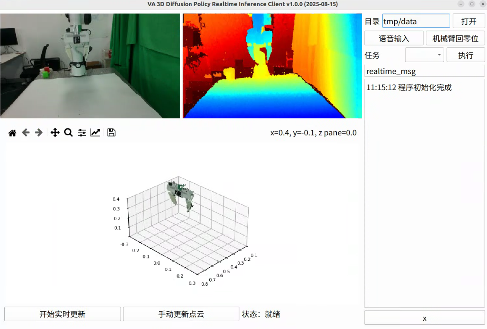

# VA 3D Diffusion Policy Realtime Inference Client

使用 VA 模仿学习方法 3D Diffusion Policy（DP3）在真实环境下进行推理，用作演示目的。
机械臂控制器使用 [franka_server](https://github.com/Wel2018/franka_server)。

数据采集方法：
1. [franka_teleop](https://github.com/Wel2018/franka_teleop)
2. [franka_autopick](https://github.com/Wel2018/franka_autopick)

> [!note] 硬件平台
> - 机械臂 Franka Research 3
> - 摄像头 Realsense L515 / Orbbec Femto Bolt

## 主界面

